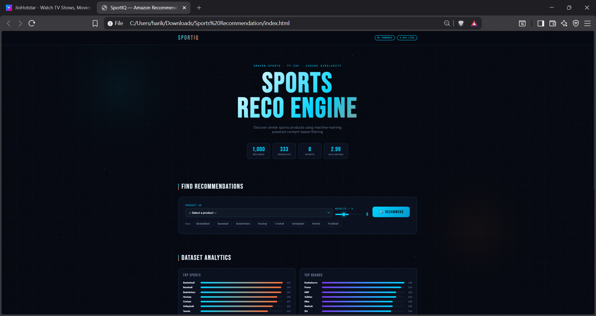
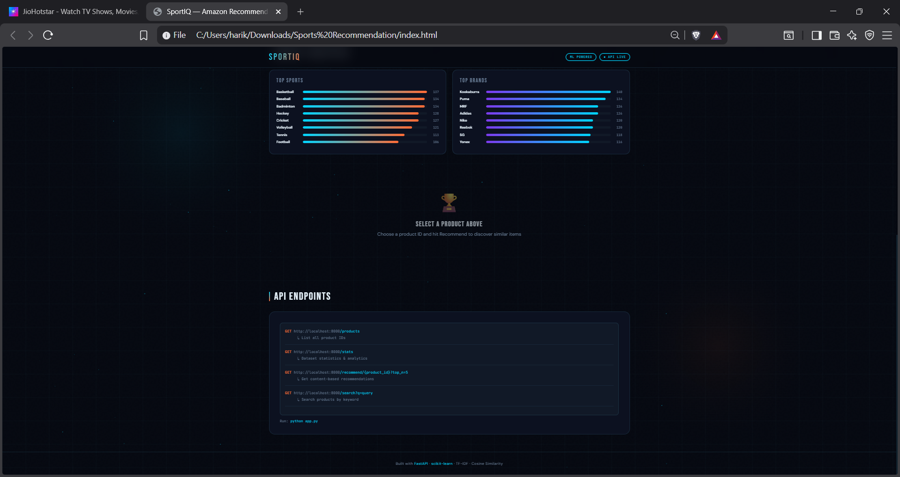
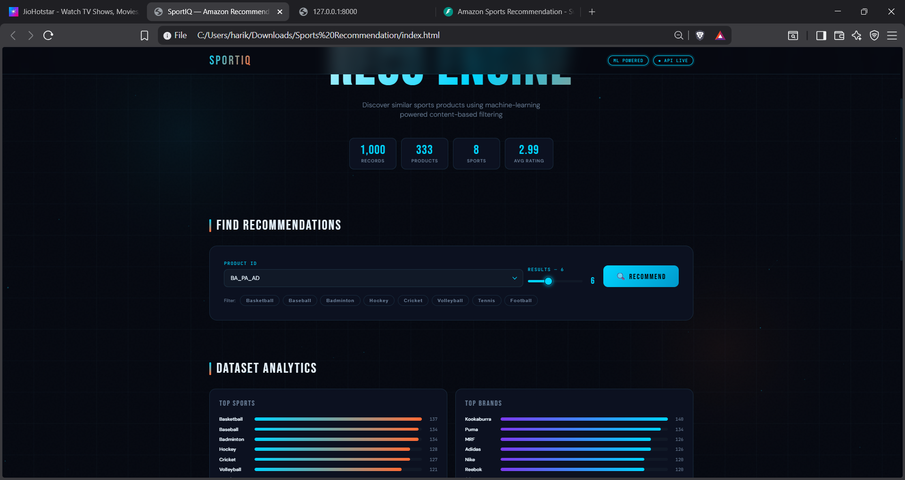
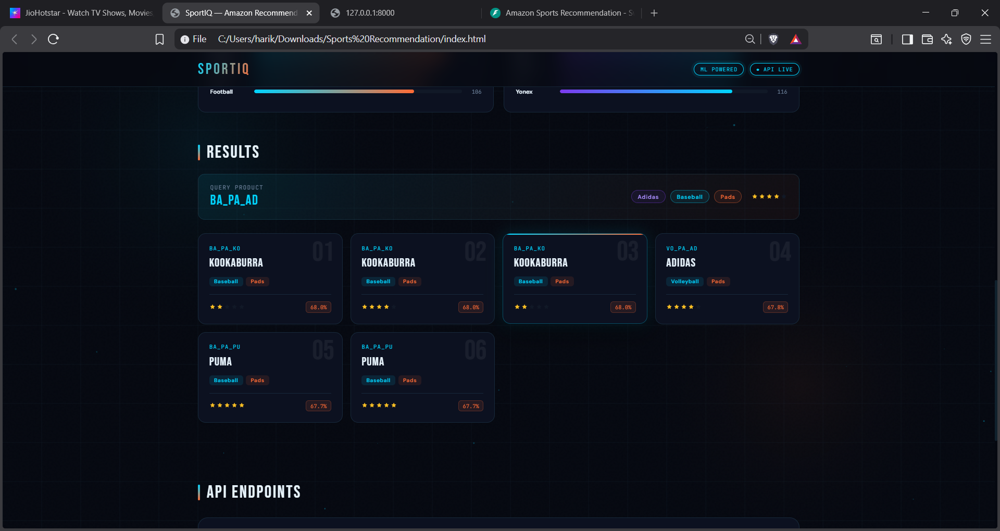
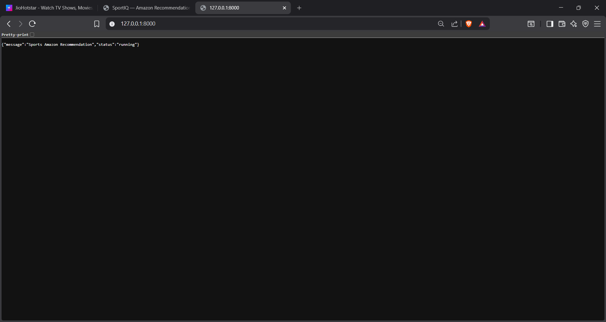
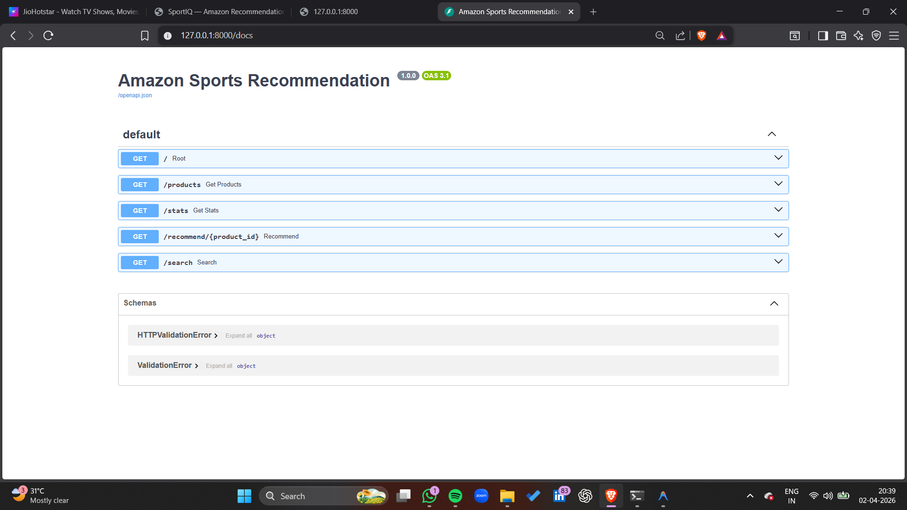
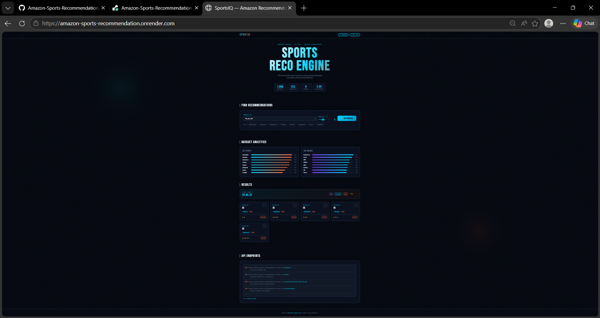
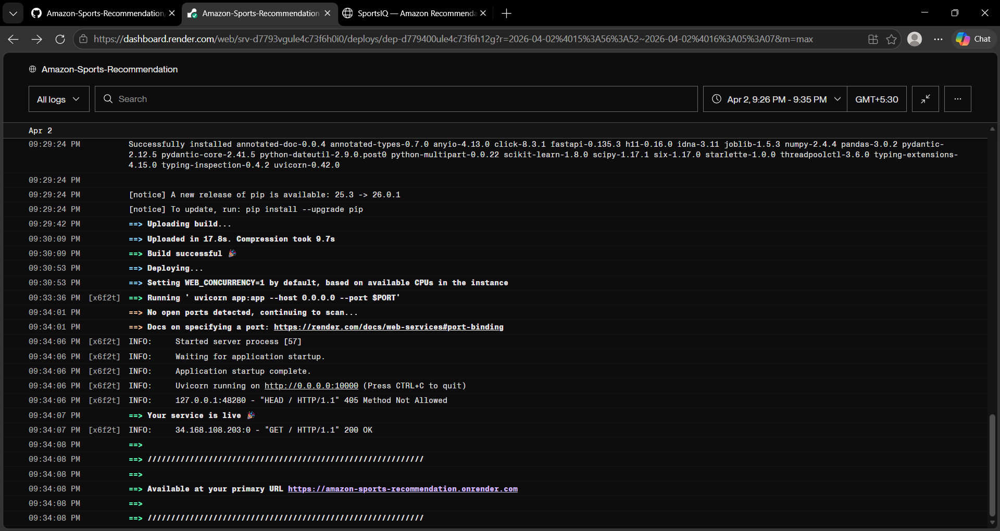
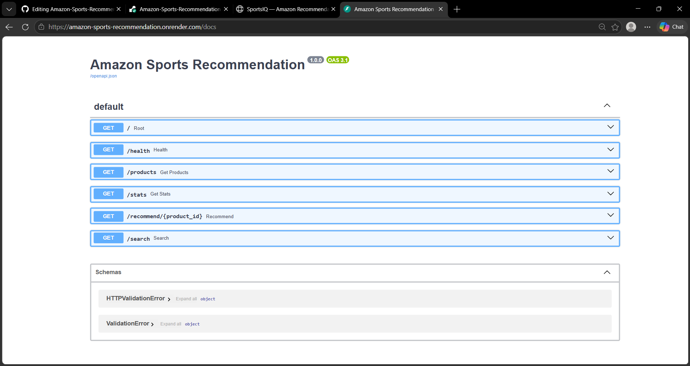

<!-- 🔥 Animated Header -->
<h1 align="center">🚀 SportIQ</h1>
<h3 align="center">Amazon Sports Recommendation Engine</h3>

  

## 🏷️ Badges

  
  
  
  

  🔗 <b>Live App:</b> https://your-app.onrender.com

## ✨ Overview

**SportIQ** is a high-performance recommendation engine that delivers **personalized sports product suggestions** using **NLP and Machine Learning**.

It uses **TF-IDF Vectorization** and **Cosine Similarity** to recommend products based on content similarity.

## 🎯 Features

- 🔍 Smart Content-Based Recommendations  
- ⚡ FastAPI High-Speed Backend  
- 🧠 NLP-based Similarity Engine  
- 📊 Real-time Product Insights  
- 🎨 Interactive UI with animations  
- 🟢 Demo Mode support  

## 🖼️ Screenshots

### 🏠 Home Page

### 🎯 Recommendations

### 📊 API Docs

## 🌐 Live Demo Preview

### 🏠 Home Page (Live)

🔗 https://amazon-sports-recommendation.onrender.com

### 📊 API Documentation (FastAPI Swagger)

🔗 https://amazon-sports-recommendation.onrender.com/docs

## 🏗️ Project Structure

SportIQ/
│
├── app.py
├── recommendation.py
├── index.html
├── requirements.txt
├── Sports-Amazon dataset.csv

## ⚙️ Tech Stack

- **Backend:** FastAPI  
- **ML:** scikit-learn  
- **Data:** pandas, numpy  
- **NLP:** TF-IDF  
- **Similarity:** Cosine Similarity  

## 🚀 Getting Started

### Install Dependencies

bash
pip install -r requirements.txt

### Run Backend

bash
python app.py

📍 API: http://localhost:8000  
📘 Docs: http://localhost:8000/docs  

## 📡 API Endpoints
| Method | Endpoint | Description |
|--------|----------|------------|
| GET | /products | Get all products |
| GET | /stats | Dataset insights |
| GET | /recommend/{id} | Recommendations |
| GET | /search?q= | Search |

## 🧠 How It Works

- Combines product features (title, category, brand)  
- Converts text → vectors using TF-IDF  
- Computes similarity using cosine distance  
- Returns top-N recommendations  

## 📊 Sample Output
json
{
  "product_id": "SP123",
  "recommendations": [
    {"id": "SP456", "score": 0.87},
    {"id": "SP789", "score": 0.82}
  ]
}
## 🌐 Deployment

Deployed on **Render**

bash
gunicorn app:app

## 💡 Future Enhancements

- 🔮 Hybrid Recommendation System  
- 🤖 Deep Learning (BERT)  
- 📱 Mobile Optimization  
- 👤 User Personalization  

## 👩‍💻 Author

**Harika Satti**  
Aspiring Data Scientist 🚀  

⭐ If you like this project, give it a star!
